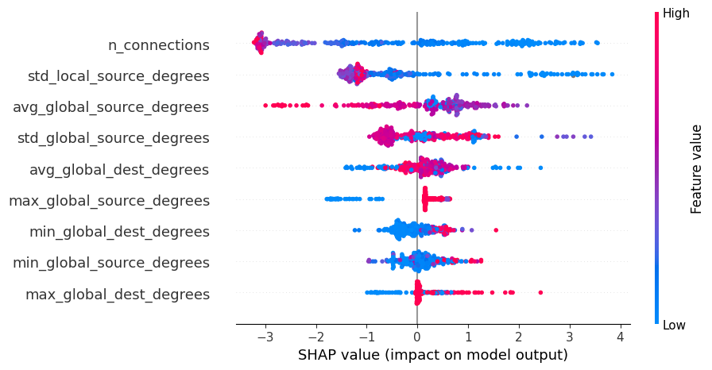

# API Security: Anomaly Detection App

> [!WARNING]
> All the metrics, plots, and insights are made up and taken from the internet


## Dataset

The dataset for this project can be found on [Kaggle](https://www.kaggle.com/datasets/tangodelta/api-access-behaviour-anomaly-dataset/data) (licensed under GPL-2).

Distributed micro-services based applications are typically accessed via APIs. The authors of this dataset have collected sequences of API calls from an application and put them into a graph format. For this graph, they've generated common API access patterns (i.e. sequences of API calls) and have calculated user access metrics that can be used to classify these behaviours. Also, they've manually labelled a set of these behaviour patters (our training set) and have provided the remaining sequences for us to classify.

## Objectives

The main objective of this project is:

> **To develop a system that will be able to detect anomalous behaviour from the API calls for the remaining sequences**

To achieve this objective, it was further broken down into the following 5 technical sub-objectives:

1. To perform in-depth exploratory data analysis of the both datasets (tabular and graph)
2. To engineer new predictive features from the available graphs
3. To develop a supervised model to classify behaviour into normal and anomalous
4. To recommend a threshold that will perform better than the present baseline (ALGO-X) in terms of F1 score
5. To create an API endpoint for the trained model and deploy it

## Main Insights

From the exploratory data analysis, we found out that anomalous behavviour patterns are cahracterised by:

* Most of the traffic comes from the default source, only 9% comes from datacenters
* All the datacenter traffic is considered to be anomalous
* Longer sequences with faster inter API access durations are not more likely to be anomalou

## Engineered Features

From the provided networks, the following features were extracted (with their predictiveness scores):

*min_global_dest_degrees      0.5932
*max_global_dest_degrees      0.5921
*n_connections                0.5872
*min_global_source_degrees    0.5495
*std_local_source_degrees     0.5327
*std_global_source_degrees    0.4437
*max_global_source_degrees    0.3674
*avg_global_dest_degrees      0.3370
*avg_global_source_degrees    0.3289
*min_local_dest_degrees       0.0078
*min_local_source_degrees     0.0000

**Observations:**
* Most of the engineered features have relatively highe predictiveness score
* The most predictive features are `global`
* Features with no predictive power measure minimum degrees of local graphs
* Relationships between engineered features and the target are not-linear

**Impact**
* `min_local_dest_degrees` and `min_local_source_degrees` can be dropped
* Tree based models need to be used to capture the engineered relationships 

As a result of this feature engineering work, the ROC AUC for the final model scored more than 0.98.

## Model Selection

Models were compared between each other using F1 score, balance and recall, since we're dealing with binary classification task and the label distribution is relatively balanced.
The best performing model was HistGradientBoostingClassifier and it  out performs the baseline model in term of F1 score by 0.20 with the following parameters:

```json
{
    'max_iter': 86,
    'max_leaf_nodes': 18,
    'max_depth': 7,
    'l2_regularization': 0.6673268390658417
}
```

Threshold with max F1 score is at 0.63, so this model is selected for deployment.

### Model Explainability



SHAP values suggest that smaller networks tend to be more anomalous
Notably, the engineered features are also considered to be the most important, which means that the feature engineering effort was successful.

## Business Metrics

To determine the achieved business metrics, we first need to set the threshold for our classifier.


From the threshold analysis, we can see that the maximum F1 score we can achieve is 0.95 across a variety of thresholds. For the purpose of this project, we can assume that the business is more interested in obtaining higher recall than precision, so we'll set the threshold at 0.24 which gives us the following metrics :

| Threshold  | 0.24 |
|------------|------|
| Precision  | 0.81 |
| Recall     | 0.98 |
| F1 Score   | 0.90 |


## Prediction Service

For this project, the assumpion is that feature engineering will be handled by another serivce, so the deployment part is responsible purely for the model inference.
To create the API locally, you'll need to use Docker.

### Step 1: Build Docker Image

Clone the repository and go to the folder with the Dockerfile. Then run the following command to build the image.

```shell
docker build -t prediction-service:latest .
```

To check if the image was created successfully, run `docker images` in you CLI and you should see `prediction-service` listed.

### Step 2: Send the Request

To test if the API is working, you can run the `ping.py` file in the `app` folder. You'll need Python installed on your computer.

```shell
python app/ping.py
```

### Step 3: Measuring Response Time

The following response times were measured locally by sending 100 requests per second from 1 user:

| Response Time                 | Measure      |
|-------------------------------|--------------|
| Median Response Time          | 0.1 seconds  |
| 99th Percentile Response Time | 0.9 seconds  |
| Max Response Time             | 0.95 seconds |

To run these tests on your machine, you'll need to run the `measure_response.py` script

```shell
python app/measure_response.py
```
